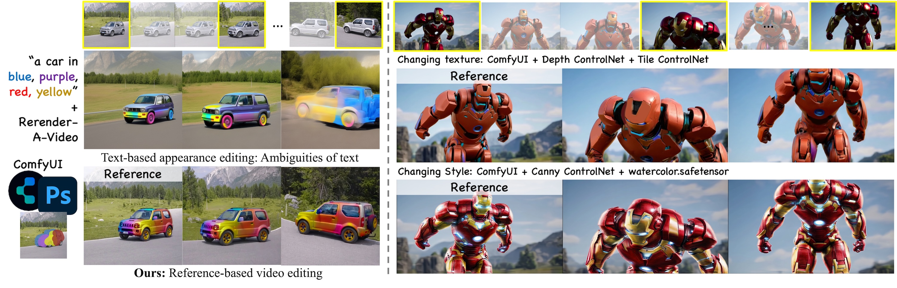

# Zero-to-Hero: Zero-Shot Initialization Empowering Reference-Based Video Appearance Editing
&nbsp;
&nbsp;

# Abstract
Appearance editing in video according to user needs is a pivotal task in video editing. Existing text-guided methods often lead to ambiguities regarding user intentions and restrict fine-grained control over editing specific aspects of objects. To overcome these limitations, this paper introduces a novel approach named \emph{Zero2Hero}, which focuses on reference-based video editing that disentangles the editing process into two distinct problems. It achieves this by first editing an anchor frame to satisfy user requirements as a reference image and then consistently propagating its appearance across other frames. 
In our Zero-Stage, we leverage correspondence within the original frames to guide the attention mechanism, which is more robust than previously proposed optical flow or temporal modules in memory-friendly video generative models, especially when dealing with objects exhibiting large motions. It provides a good starting point with accurate and temporally consistent appearance transfer. However, intervention in the attention mechanism can degrade image quality, leading to over-saturated colors and unknown blurring issues. Starting from Zero-Stage, our Hero-Stage can efficiently learn a conditional generative model to restore frames with degradation through a proxy task using the anchor frame and the reference image.
To evaluate consistency more accurately, we construct a group of videos with multiple appearances using Blender, which supports fine-grained evaluation. Our method outperforms the best-performing baseline with a PSNR improvement of 2.6 dB.

